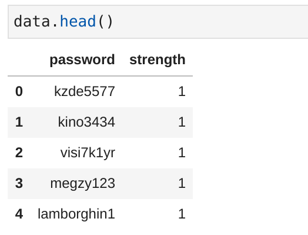
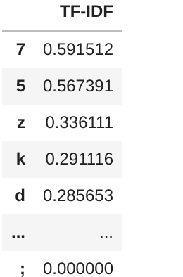

# Project7 Predict Password Strength Natural Language Processing
20. [Enlaces ](#schema20)

# 1 Importar librerías y cargar datos
~~~python
import pandas as pd
import numpy as np
import seaborn as sns
import warnings
warnings.filterwarnings('ignore')
import random
from sklearn.feature_extraction.text import TfidfVectorizer

data = pd.read_csv("./data/data.csv", error_bad_lines=False)
~~~

~~~python
data['strength'].unique()
array([1, 2, 0])
~~~

# 2 Comprobar los nulos
~~~python
data.isna().sum()
password    1
strength    0
dtype: int64

data.dropna(inplace = True)
~~~

# 3. Tenerlos datos en una tupla
~~~python
password_tuple = np.array(data)
password_tuple
array([['kzde5577', 1],
       ['kino3434', 1],
       ['visi7k1yr', 1],
       ...,
       ['184520socram', 1],
       ['marken22a', 1],
       ['fxx4pw4g', 1]], dtype=object)
       
       
random.shuffle(password_tuple)

x = [labels[0] for labels in password_tuple]
y = [labels[1] for labels in password_tuple]
~~~

# 4. crear una función personalizada para dividir la entrada en caracteres de la lista
~~~python
def word_divide_char(inputs):
    character=[]
    for i in inputs:
        character.append(i)
    return character
word_divide_char('kzde5577')
['k', 'z', 'd', 'e', '5', '5', '7', '7']
~~~

# 5. importar vectorizador TF-IDF para convertir datos de cadena en datos numéricos

~~~python
vectorizer=TfidfVectorizer(tokenizer=word_divide_char)
X=vectorizer.fit_transform(x)
X=vectorizer.fit_transform(x)

X.shape
(669639, 132)

first_document_vector=X[0]
first_document_vector
<1x132 sparse matrix of type '<class 'numpy.float64'>'
	with 6 stored elements in Compressed Sparse Row format>

df=pd.DataFrame(first_document_vector.T.todense(),index=vectorizer.get_feature_names(),columns=['TF-IDF'])
df.sort_values(by=['TF-IDF'],ascending=False)
~~~

